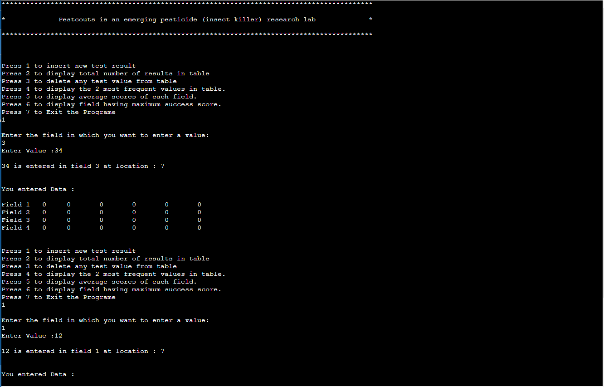

# Data Manipulation in Array using Pointers in C++

This is project that build with C++. You can implement 2d data manipulation by this project. there are many levels in this project. As you can see int he Image in the Above. You can review and implement your logic in this project.

## Authors

- [@nomankhokhar](https://www.github.com/nomankhokhar)

## Badges

## 🚀 About Me

I'm a full stack developer...
